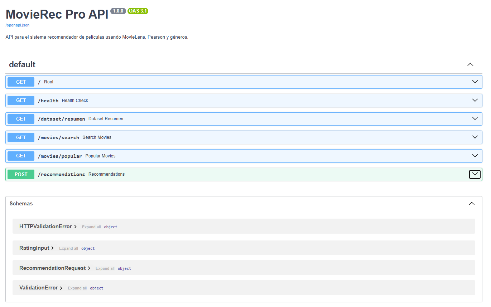
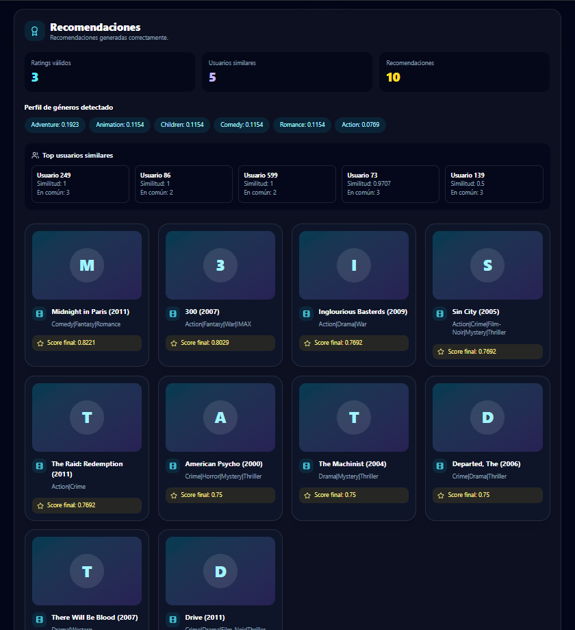
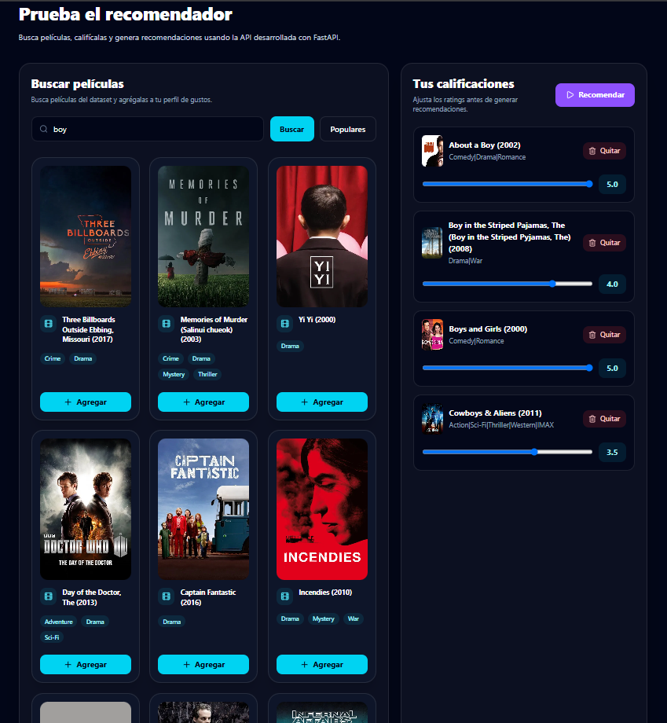
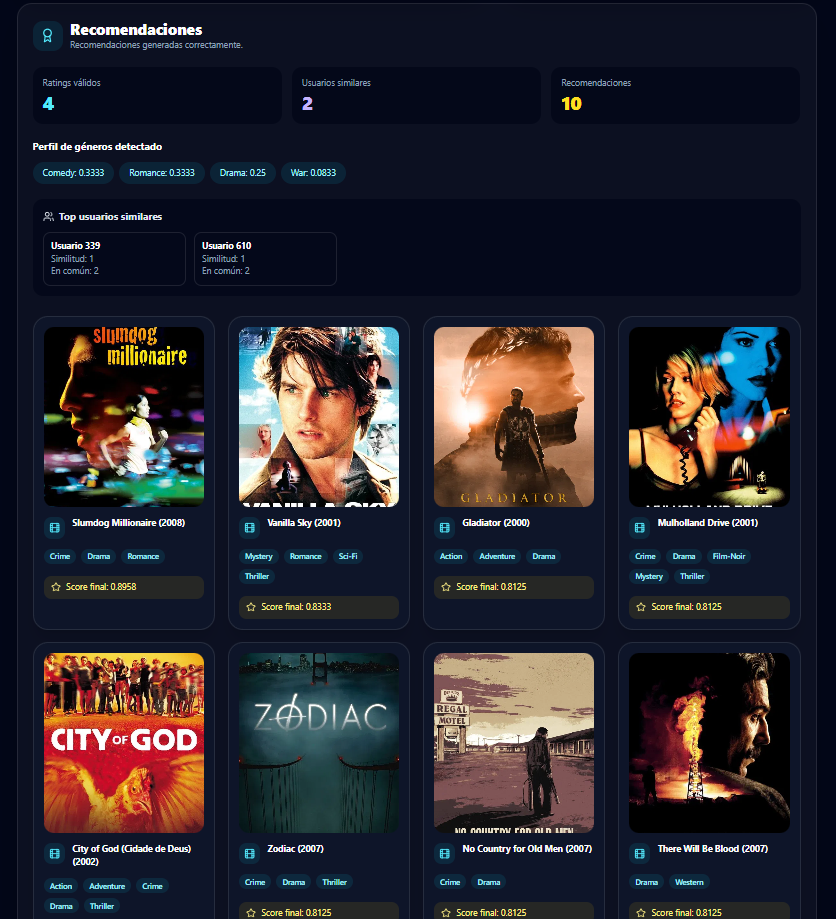

# Sistema Recomendador de Películas - Complejidad Algorítmica

Proyecto desarrollado para el curso de **Complejidad Algorítmica**.

El sistema recomienda películas usando el dataset **MovieLens**, técnicas de grafos, filtrado colaborativo, correlación de Pearson, ponderación por género y una mejora visual con pósters reales obtenidos desde **TMDB**.

## Integrantes

* Cardenas Cabrera, Angel David
* Gonzales Galán, Bernabé
* Condori Valeriano, Andy Cristian
* Montesinos Condori, Tony
* Orbegoso Villanueva, Joseph Slater

## Descripción del proyecto

El proyecto consiste en un sistema recomendador de películas que permite al usuario buscar películas, calificarlas y recibir recomendaciones personalizadas.

En el primer avance se trabajó con un grafo bipartito usuario-película y una recomendación basada en recorrido BFS. Para el Hito 2 se amplió el proyecto incorporando una arquitectura modular con backend, frontend web y nuevos criterios de recomendación como correlación de Pearson y ponderación por género.

Para el Hito 3 se incorporó una mejora visual usando pósters reales de películas mediante la API de TMDB. Esta mejora permite que la interfaz web sea más atractiva y profesional, mostrando imágenes reales en las tarjetas de películas buscadas, populares y recomendadas.

Actualmente el sistema permite:

* Cargar y procesar el dataset MovieLens.
* Construir una matriz usuario-película.
* Calcular similitud entre usuarios usando correlación de Pearson.
* Detectar géneros preferidos del usuario.
* Ajustar el ranking final combinando Pearson y géneros.
* Exponer una API con FastAPI.
* Usar una interfaz web desarrollada con Next.js.
* Buscar películas, calificarlas y generar recomendaciones desde la web.
* Integrar pósters reales de películas usando la API de TMDB.
* Mostrar tarjetas visuales con imagen real, géneros, score final y datos del algoritmo.

## Objetivo general

Desarrollar un sistema recomendador de películas que aplique técnicas de complejidad algorítmica, grafos y programación modular para generar recomendaciones personalizadas a partir de las preferencias del usuario.

## Objetivos específicos

* Procesar el dataset MovieLens para obtener usuarios, películas, géneros y calificaciones.
* Representar la relación usuario-película mediante estructuras de datos y grafos.
* Implementar recomendación colaborativa usando correlación de Pearson.
* Incorporar una ponderación por género para mejorar la personalización.
* Diseñar una API backend para conectar el algoritmo con una interfaz web.
* Crear una interfaz web interactiva para buscar películas, registrar calificaciones y visualizar resultados.
* Integrar pósters reales usando TMDB para mejorar la presentación visual del sistema.
* Mantener evidencias visuales del funcionamiento del algoritmo, como usuarios similares, perfil de géneros y score final.

## Dataset utilizado

Se utiliza el dataset **MovieLens Small**, el cual contiene información de usuarios, películas, géneros y calificaciones.

Archivos principales utilizados:

```text
data/ml-latest-small/ratings.csv
data/ml-latest-small/movies.csv
data/ml-latest-small/links.csv
```

Además, se genera un archivo filtrado:

```text
data/peliculas_2000.csv
```

Este archivo contiene películas seleccionadas a partir del año 2000 y permite trabajar con un conjunto de datos más manejable para las pruebas del proyecto.

El archivo `links.csv` se utiliza en el Hito 3 para relacionar el `movieId` de MovieLens con el `tmdbId` de TMDB, permitiendo obtener pósters reales de las películas.

## Tecnologías utilizadas

### Python

* pandas
* numpy
* networkx
* matplotlib
* pyvis
* openpyxl
* requests
* python-dotenv
* FastAPI
* Uvicorn

### Frontend

* Next.js
* TypeScript
* Tailwind CSS
* pnpm

### Servicios externos

* TMDB API

### Herramientas

* Visual Studio Code
* Git
* GitHub
* PowerShell

## Estructura del proyecto

```text
Sistema-recomendador-peliculas/
├── app_desktop/
│   ├── obtener_posters_recomendacion.py
│   └── interfaz_usuario.py
│
├── backend/
│   ├── main.py
│   └── recommender/
│       ├── __init__.py
│       ├── data_loader.py
│       ├── pearson.py
│       ├── genre_filter.py
│       ├── tmdb_client.py
│       └── service.py
│
├── data/
│   ├── ml-latest-small/
│   ├── outputs/
│   ├── peliculas_2000.csv
│   ├── tmdb_posters_cache.json
│   └── grafo_bipartito_peliculas.gml
│
├── docs/
│   └── evidencias/
│
├── scripts/
│   ├── 01_descarga_dataset.py
│   ├── 02_preprocesamiento_dataset.py
│   ├── 03_grafo_bipartito_con_networkx.py
│   ├── 04_recomendacion_bfs.py
│   ├── 05_recomendacion_pearson.py
│   └── 06_filtro_genero.py
│
├── web/
│   ├── app/
│   ├── components/
│   ├── lib/
│   ├── public/
│   ├── package.json
│   ├── pnpm-lock.yaml
│   └── tsconfig.json
│
├── requirements.txt
├── README.md
├── .env.example
└── .gitignore
```

## Algoritmos y técnicas aplicadas

### 1. Grafo bipartito usuario-película

Se construyó un grafo donde existen dos tipos de nodos:

* Usuarios
* Películas

Las aristas representan calificaciones realizadas por usuarios a películas. Esto permite visualizar relaciones y explorar conexiones entre usuarios y películas.

### 2. Recomendación basada en BFS

En el primer avance se implementó una recomendación usando BFS sobre el grafo bipartito.

El proceso fue:

1. Partir de un usuario objetivo.
2. Buscar películas bien calificadas por ese usuario.
3. Encontrar usuarios relacionados mediante esas películas.
4. Recomendar películas bien calificadas por usuarios similares.

### 3. Correlación de Pearson

Para el Hito 2 se implementó una mejora usando correlación de Pearson.

La idea es comparar el patrón de calificaciones del usuario nuevo con usuarios existentes del dataset.

La similitud puede interpretarse así:

```text
1     = gustos muy parecidos
0     = no hay relación clara
-1    = gustos opuestos
```

En el sistema se consideran principalmente usuarios con similitud positiva.

### 4. Perfil de géneros

El sistema también analiza los géneros de las películas calificadas positivamente por el usuario.

Por ejemplo, si el usuario califica bien películas de aventura, acción y fantasía, el sistema asigna mayor peso a esos géneros.

El perfil de géneros ayuda a ajustar el ranking final de recomendaciones.

### 5. Score final

El ranking final combina:

* Score por Pearson
* Score por género

La fórmula utilizada es:

```text
score_final = 0.75 * score_pearson_normalizado + 0.25 * score_genero
```

Esto permite que las recomendaciones consideren tanto usuarios similares como preferencias temáticas del usuario.

## Hito 3 - Integración de pósters reales con TMDB

Para el Hito 3 se implementó una mejora visual en la interfaz web mediante la integración de pósters reales de películas usando la API de TMDB.

La integración se realizó desde el backend para evitar exponer la API Key en el frontend. El sistema utiliza el archivo `links.csv` de MovieLens para relacionar el `movieId` del dataset con el `tmdbId` correspondiente en TMDB. Con ese identificador, el backend consulta la API externa y obtiene la URL del póster de cada película.

Cuando una película no tiene un `tmdbId` válido o no se encuentra un póster mediante el identificador, el sistema puede realizar una búsqueda por título como mecanismo de respaldo.

Además, se implementó una caché local en el archivo:

```text
data/tmdb_posters_cache.json
```

Esta caché evita consultas repetidas a la API de TMDB y mejora el tiempo de respuesta del sistema.

### Funcionalidades agregadas en el Hito 3

* Consulta de pósters reales usando TMDB.
* Relación entre MovieLens y TMDB mediante `links.csv`.
* Generación del campo `poster_url` desde el backend.
* Integración de pósters en películas buscadas, populares y recomendadas.
* Implementación de caché local para reducir llamadas repetidas a la API.
* Rediseño de tarjetas visuales en el frontend.
* Visualización de géneros como etiquetas.
* Mejora de presentación de títulos largos.
* Mantenimiento de información algorítmica como score final, usuarios similares y perfil de géneros.

### Variable de entorno requerida

Para usar la integración con TMDB, se debe crear un archivo `.env` en la raíz del proyecto con la siguiente variable:

```env
TMDB_API_KEY=tu_api_key_de_tmdb
```

Por seguridad, el archivo `.env` no debe subirse al repositorio. En su lugar, se incluye un archivo `.env.example` como referencia.

## Backend API

El backend fue desarrollado con **FastAPI**.

Para ejecutar la API:

```bash
python -m uvicorn backend.main:app --reload
```

Luego abrir:

```text
http://127.0.0.1:8000/docs
```

### Endpoints principales

```text
GET  /
GET  /health
GET  /dataset/resumen
GET  /movies/search
GET  /movies/popular
POST /recommendations
```

### Ejemplo de petición a `/recommendations`

```json
{
  "ratings": [
    {
      "movieId": 4993,
      "rating": 5.0
    },
    {
      "movieId": 5952,
      "rating": 4.5
    },
    {
      "movieId": 7153,
      "rating": 5.0
    }
  ],
  "top_n": 10,
  "top_k_users": 10
}
```

### Ejemplo de respuesta con póster

Después de la integración con TMDB, las películas pueden incluir el campo `poster_url`:

```json
{
  "movieId": 95510,
  "title": "Amazing Spider-Man, The (2012)",
  "genres": "Action|Adventure|Sci-Fi|IMAX",
  "poster_url": "https://image.tmdb.org/t/p/w500/...",
  "score_final": 0.8468
}
```

## Frontend web

La interfaz web fue desarrollada con **Next.js**.

Para ejecutar la web:

```bash
cd web
pnpm install
pnpm dev
```

Luego abrir:

```text
http://localhost:3000
```

La web permite:

* Buscar películas por título.
* Cargar películas populares.
* Agregar películas al perfil del usuario.
* Modificar calificaciones con sliders.
* Enviar las calificaciones al backend.
* Visualizar recomendaciones.
* Ver usuarios similares.
* Ver géneros preferidos detectados.
* Ver el score final de cada recomendación.
* Mostrar pósters reales de películas.
* Mostrar géneros como etiquetas visuales.
* Mantener un diseño de respaldo cuando una película no tiene póster disponible.

## Instalación del proyecto

### 1. Clonar el repositorio

```bash
git clone https://github.com/DavidCardenas-hub/Sistema-recomendador-de-pel-culas---Complejidad-Algor-tmica
cd Sistema-recomendador-de-pel-culas---Complejidad-Algor-tmica
```

## Ejecución del proyecto

### 1. Instalar dependencias de Python

```bash
python -m pip install -r requirements.txt
```

### 2. Configurar variable de entorno de TMDB

Crear un archivo `.env` en la raíz del proyecto:

```env
TMDB_API_KEY=tu_api_key_de_tmdb
```

También se incluye el archivo `.env.example` para indicar el formato esperado.

### 3. Descargar el dataset

```bash
python scripts/01_descarga_dataset.py
```

### 4. Ejecutar preprocesamiento

```bash
python scripts/02_preprocesamiento_dataset.py
```

### 5. Generar grafo bipartito

Este paso construye el grafo usuario-película utilizado en el primer avance del proyecto y permite conservar la representación basada en grafos.

```bash
python scripts/03_grafo_bipartito_con_networkx.py
```

### 6. Ejecutar recomendación BFS

Este paso corresponde al recomendador inicial basado en recorrido BFS sobre el grafo bipartito.

```bash
python scripts/04_recomendacion_bfs.py
```

### 7. Ejecutar recomendación por Pearson

Este paso corresponde a la mejora implementada para el Hito 2.

```bash
python scripts/05_recomendacion_pearson.py
```

### 8. Ejecutar filtro por género

Este paso permite construir el perfil de géneros del usuario y ajustar el ranking de recomendaciones.

```bash
python scripts/06_filtro_genero.py
```

### 9. Ejecutar backend

```bash
python -m uvicorn backend.main:app --reload
```

Luego abrir:

```text
http://127.0.0.1:8000/docs
```

También se puede probar la búsqueda de películas con pósters:

```text
http://127.0.0.1:8000/movies/search?q=spider&limit=8
```

### 10. Ejecutar frontend

En otra terminal:

```bash
cd web
pnpm install
pnpm dev
```

Luego abrir:

```text
http://localhost:3000
```

## Nota sobre el uso de BFS y Pearson

En el primer avance del proyecto se implementó un modelo basado en grafo bipartito usuario-película y un recomendador usando BFS. Esta parte se mantiene como base del proyecto y como evidencia de la aplicación de grafos.

Para el Hito 2, el sistema fue mejorado con un recomendador basado en correlación de Pearson y ponderación por género. Por ello, la interfaz web actual utiliza principalmente el backend con Pearson y filtro de géneros para generar las recomendaciones.

En resumen, BFS y el grafo bipartito forman parte de la evolución del sistema, mientras que Pearson y géneros representan la mejora principal del Hito 2.

## Evidencias del Hito 2

### API FastAPI

La API fue probada desde la documentación interactiva de FastAPI.



### Frontend web

La interfaz web permite buscar películas, registrar calificaciones y generar recomendaciones.



## Evidencias del Hito 3

### Búsqueda de películas con pósters reales

La búsqueda de películas ahora muestra tarjetas visuales con pósters reales obtenidos desde TMDB.



### Recomendaciones con pósters reales

Las recomendaciones generadas por el sistema también muestran pósters reales, géneros como etiquetas y score final.



### API devolviendo `poster_url`

El backend devuelve el campo `poster_url` junto con las películas buscadas, populares y recomendadas.


## Estado actual del proyecto

El proyecto actualmente cuenta con:

* Backend funcionando localmente.
* Frontend funcionando localmente.
* Integración frontend-backend.
* Recomendación por Pearson.
* Ponderación por género.
* Visualización de usuarios similares.
* Visualización del perfil de géneros.
* Generación de recomendaciones desde la web.
* Integración de pósters reales usando TMDB.
* Tarjetas visuales mejoradas con imagen, título, géneros y score final.
* Caché local para pósters consultados desde TMDB.

## Mejoras futuras

Como posibles mejoras futuras se plantea:

* Despliegue del frontend en Vercel.
* Despliegue del backend en Render, Railway u otro servicio.
* Mejora del sistema de caché de pósters.
* Optimización de consultas a TMDB.
* Validación más detallada de resultados.
* Pruebas con distintos perfiles de usuario.
* Video demostrativo del sistema completo.
* Informe final con análisis de complejidad y conclusiones.

## Nota sobre pósters de películas

La funcionalidad de pósters reales fue integrada en el Hito 3 usando la API de TMDB. El backend obtiene las imágenes a partir del `tmdbId` disponible en el archivo `links.csv` de MovieLens y devuelve el campo `poster_url` al frontend.

La interfaz web utiliza este campo para mostrar tarjetas visuales con pósters reales. Si una película no cuenta con póster disponible, el sistema mantiene un diseño de respaldo para evitar errores visuales.
